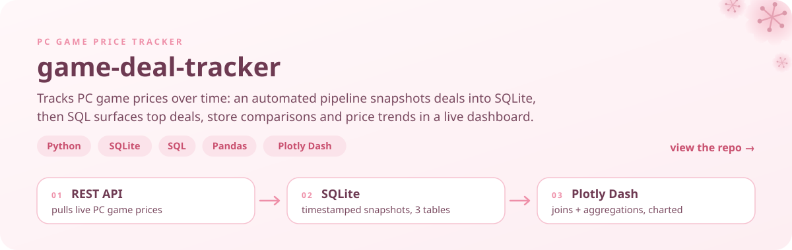
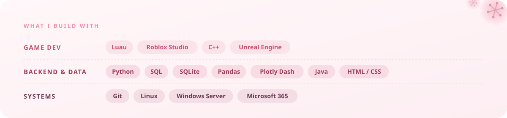

  

  

  
  

## ✿ hi, i'm josh

CS student at **Ontario Tech** (class of '29) in Whitby, ON. I build games in **Roblox Studio** with **Luau**, and I like the backend side of software: data pipelines, SQL and dashboards. Before uni I spent a year in IT support at an MSP, imaging ~100 machines and keeping ~40 small businesses running, so I also know what it looks like when systems break.

  
  

**right now**

- 🎮 building games in **Roblox Studio**, all in **Luau**
- 📊 just shipped **[game-deal-tracker](https://github.com/JMScripts1/game-deal-tracker)**
- 📚 this term: **Data Structures** + **Linear Algebra**
- 💬 ask me about Luau, Python + SQL, or why your PC won't boot

## ✿ featured project

  

## ✿ toolbox

  

## ✿ on github

  
  

  

