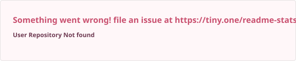

  

  

  
  
  

## ✿ hi, i'm josh

I'm a computer science student at Ontario Tech University (class of '29), based in Whitby, Ontario. I split my time between two things: building games in Roblox Studio with Luau, and the backend side of software, like data pipelines, SQL and dashboards.

Before uni I spent a year in IT support at a managed services provider, imaging around 100 machines and keeping about 40 small businesses running. So I also know what it looks like when systems break.

  
  

## ✿ right now

- 🎮 building games in **Roblox Studio**, scripting everything in **Luau**
- 📊 just wrapped **[game-deal-tracker](https://github.com/JMScripts1/game-deal-tracker)**, my PC game price tracker
- 📚 this term: **Data Structures** and **Linear Algebra**
- 💬 ask me about Luau, Python + SQL, or why your PC won't boot

## ✿ featured project

  

An automated Python pipeline pulls PC game prices from a public REST API and saves timestamped snapshots into a 3-table SQLite schema. SQL joins and aggregations then surface top deals, store comparisons and price trends in an interactive Plotly Dash dashboard.

## ✿ tools i reach for

  <b>game dev</b> 
  
  
  
  

  <b>backend &amp; data</b> 
  
  
  
  
  
  

  <b>systems</b> 
  
  
  
  

## ✿ on github

  
  

  

